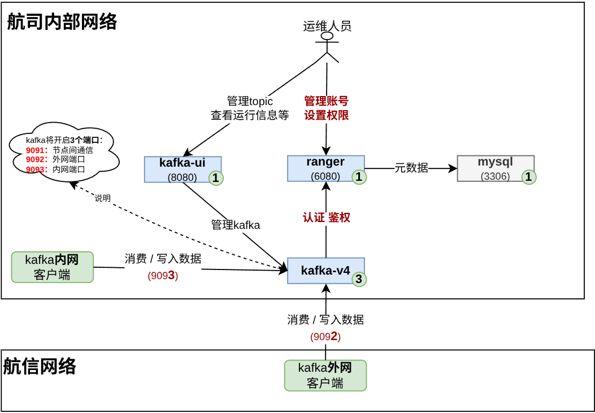
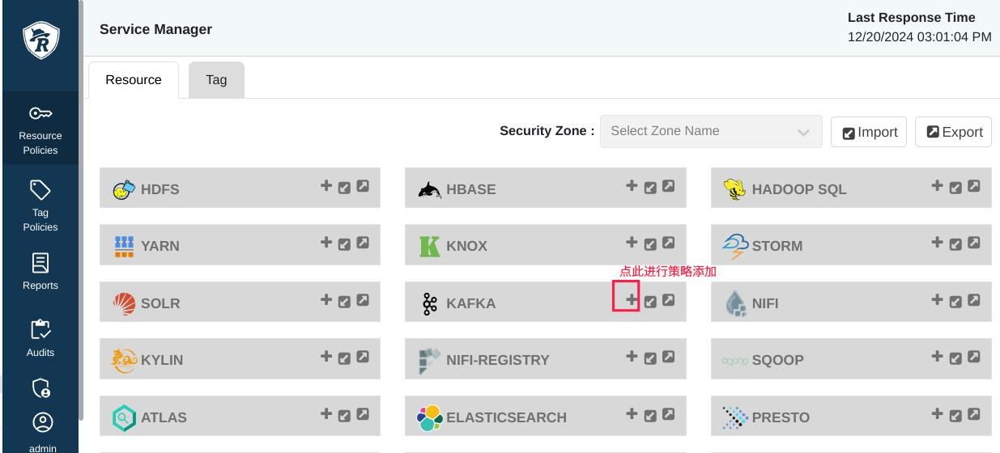
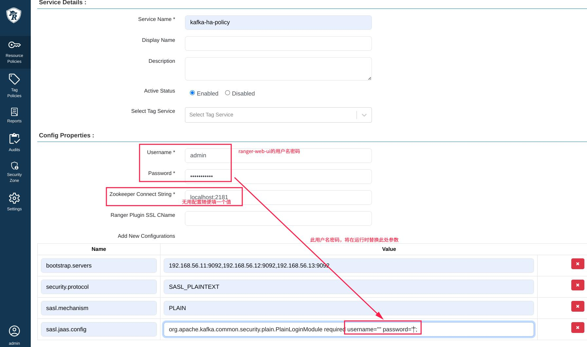
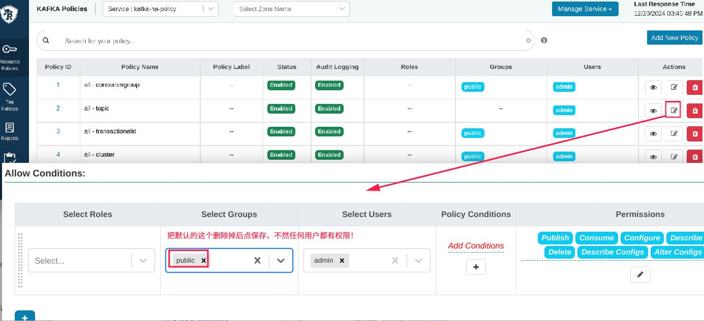
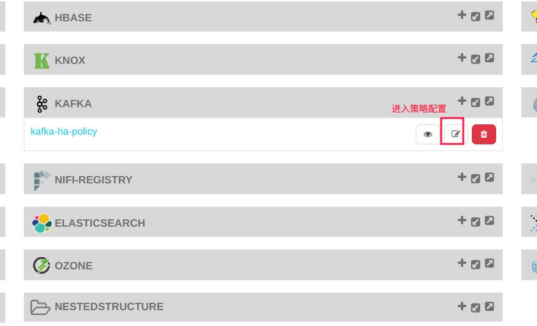
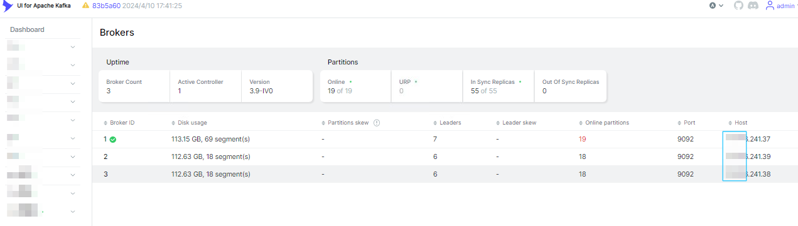
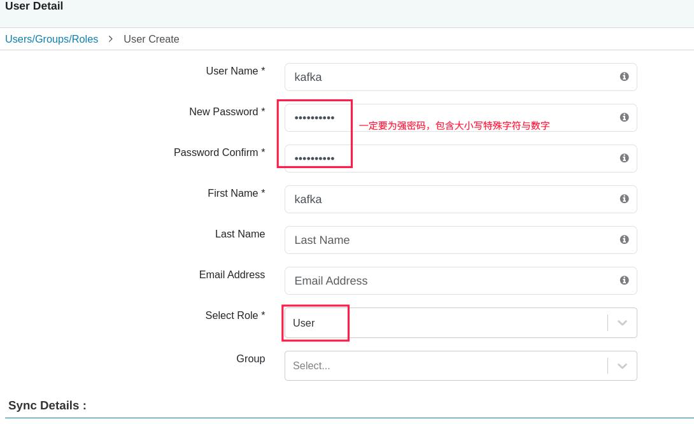
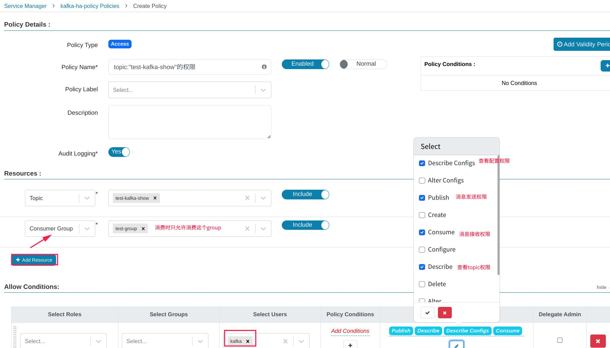

# v3.一键安装安装使用指南

## 0.整体架构  
  
## 1.说明
本方案，需要至少4台服务器，每台服务器需要安装kafka与zookeeper，权限/与运维工具将安装在第一台，如果想要安装单机版本,有以下两种方案：
* [kafka3.x单机方案](./docs/kafka3.x-single-docker.md)
* [kafka4.x单机方案](docs/kafka4.x-single-docker-compose.md)

资源要求：4C/8g,`文件打开数`>=655350,文件打开数修改方式如下:  
```shell script
sudo echo "* soft nofile 655350" >> /etc/security/limits.conf
sudo echo "* hard nofile 655350" >> /etc/security/limits.conf
# 退出，重新登录后查看修改结果：
ulimit -n
```

相关组件说明:  
**若想修改一些默认参数，请看官方说明**

* 2.kafka
docker地址：<https://xuanyuan.cloud/r/apache/kafka>

## 2.版本更新记录

**v4.1.0**.2026-01-30

> * 1、将kafka切换为kafka4.1.1（修复低版本已知漏洞）
> * 2、将bitnami/kafka切换为apache/kafka（bitnami/kafka已从官网删除，不会提供后续升级服务）
> * 3、删除zookeeper组件，kafka4.1.1已内置相关组件（解决zookeeper安全漏洞问题）
> * 4、解决干扰日志问题(删除运行过程中报hadoop权限错误异常（无影响），删除ranger海量策略拉取日志)
> * 5、依赖的ranger未启动完成时，**kafka集群无法启动问题**(服务器同时重启时有此问题)
> * 6、解决服务器性能过低时，**kafka集群无法启动问题**
> * 7、简化kafka测试指令，不再显式指定集群ip

**历史版本信息**
[versions.md](docs/versions.md)

## 3.安装准备

### 3.0.安装脚本获取
先安装docker,参考： <https://docs.docker.com/engine/install/centos/>

```shell script
# 在任意一台服务器上下载安装脚本，若不能连网，则请直接手动下载源码
git clone https://github.com/sewenc/kafka-ha-installer.git
#或者：
git clone https://gitee.com/seawenc/kafka-ha-installer.git
```
### 3.1.离线安装准备
**若可安装的服务的主机可连网，则请跳过此部署**
```shell script
# 如果目标机器没有docker，则需要先下载docker，下载地址：https://download.docker.com/linux/static/stable/x86_64/

# 找一台可连网已安装docker的服务器,执行以下指令：
docker pull mysql
docker pull seawenc/ranger:2.5.0.2
# 此鏡像制作參考：dockerfile/Dockerfile.kafka
docker pull apache/kafka:4.1.1
docker pull provectuslabs/kafka-ui
docker save mysql | gzip > mysql.gz
docker save seawenc/ranger:2.5.0.2 | gzip > ranger.gz
docker save apache/kafka:4.1.1 | gzip > kafka.gz
docker save provectuslabs/kafka-ui | gzip > kafka-ui.gz
```
> 获得到镜像压缩包后，将文件放到**本脚本的packages目录下**（kafka.gz、ranger.gz、docker-${DOCKER_VERSION}.tgz,mysql.gz）

### 3.2.目录文件说明
```
├── bin                                    : 所有脚本目录
│   ├── common.sh                          : 通用工具脚本，无需显式调用
│   ├── step0_unpwd.sh                     : 免密码配置脚本，安装ha集群前需执行此脚本进行初始化
│   ├── step1_install_docker.sh            : 一键安装docker
│   ├── step2_install_mysql.sh             : 一键安装mysql
│   ├── step3_install_ranger.sh            : 一键安装ranger
│   ├── step4_install_kafka.sh             :一键安装kafka
│   ├── step5_install_kafkaui.sh              :一键安装kafkaui(监控工具)
│   ├── stop_kafkaui.sh                       :一键停止kafkaui(监控工具)
│   ├── stop_kafka.sh                      :一键停止所有节点的kafka
│   ├── stop_zk.sh                         :一键停止所有节点的zookeeper
│   ├── stop_mysql.sh                      :一键停止mysql
│   ├── stop_ranger.sh                     :一键停止ranger
│   ├── start_zk.sh                        :一键启动所有节点的zookeeper
│   ├── start_kafka.sh                     :一键启动所有节点的kafka
│   ├── start_kafkaui.sh                      :一键启动kafkaui
│   ├── check_kafka.sh                     :一键检查所有节点kafka状态
│   └── clear_kafka.sh                      : 清空所有kafka数据（请慎用）
├── packages                               : 离线安装包目录，其中文件需参考上一章节自行准备
├── conf                                   : 所有的配置文件
│   ├── docker                             : docker离线安装所需的文件
│   │    ├── daemon.json                   : docker核心配置文件
│   │    └── docker.service                : docker服务文件
│   ├── kafka                              : kafka所需核心配置模板文件
│   │    ├── bin                           : kafka安装所需新增脚本
│   │    ├── conf                           : kafka配置文件
│   │    ├── bins                          : kafka扩展依赖包（ranger插件等）
│   │    └── docker-compose.yml            : kafka的docker-compose文件
│   ├── ranger                              : 此目录只有一个[install.properties](conf/ranger/install.properties)文件
│   └── config.sh                          : 核心配置文件，具体配置项，请看下面介绍
├── docs                                   : 项目文档目录
├── plugin-auth                            : 权限插件
│   ├── build/libs/plugin-auth-1.0.jar     : 权限插件出的jar包
│   └── src                                : 权限插件源码

```

### 3.3.配置文件准备 
* 1.`conf/config.sh`:
```shell script
###############################0.参数配置##########################
# 需果需要自动安装docker,需要提前下载放到packages目录中,下载地址：https://download.docker.com/linux/static/stable/x86_64/

# 基本路径，与kafka都安装在此目录,请确保此目录有权限
BASE_PATH=/opt/app/kafka-ha
# 数据存放目录
DATA_DIR=/opt/app/data
###################### kafka+zookeeper 相关配置
# kafka地址,格式:  servers[内网地址]="外网地址" （如果没有网外地址，则与内网设置为一致）
declare -A servers=()
servers["192.168.56.11"]="192.168.56.11"
servers["192.168.56.12"]="192.168.56.12"
servers["192.168.56.13"]="192.168.56.13"
ssh_port=22
# kafka内网端口号 v4 版本已写死，若需要修改，请手动修改docker-compose.yml，server.properties

# kafka消息生存时间（单位小时）
kafka_msg_storage_hours=84
# admin账号密码，此密码将使用在及ranger,mysql的默认密码（请修改）
# 将作为kafka，ranger的默认密码，必须包含小写、大写、数字、特殊字符，最小8位
admin_user_pwd=aaBB@1122

###################### mysql 数据库信息
## 是否需要安装，如果已有mysql,则可修改为false,下面mysql的其它参数改为现有的数据库信息，如果需要安装，则为新库信息
mysql_need_install=true
# ！！！如果mysql_need_install=true,则自动安装mysql，ip与ranger_host一致，！！！这里配置mysql_host将无效
mysql_host=192.168.56.11
mysql_port=3306
# 请修改默认密码
mysql_root_pwd=$admin_user_pwd

###################### ranger 相关信息，必需安装，所需数据库为：mysql_host
ranger_host=192.168.56.11
# 必须跟admin_user_pwd密码一致
ranger_admin_pwd=$admin_user_pwd
# ranger数据库信息，如果mysql_need_install=true，则自动新建，否则需要提前创建
mysql_ranger_dbname=ranger
mysql_ranger_user=ranger
# mysql ranger数据库密码,默认使用统一的管理员密码，请修改
mysql_ranger_pwd=mysql@1122

###################### kafkaui相关信息
# 监控工具kafkaui安装在哪台服务器上,默认是排序后的第一台服务器，若想修改，请直接写死
kafkaui_need_install=true
# kafkaui安装在哪台服务器上，默认与mysql在同一台服务器，请修改
kafkaui_host=$mysql_host
# kafkaui的登录密码,默认使用统一的管理员密码，请修改
kafkaui_pwd=$admin_user_pwd
```
* 1.`conf/docker`: docker相关的配置，若无特殊需求，**则可不用修改**
* 2.`conf/kafka/[docker-compose.yml](conf/kafka/docker-compose.yml)`: kafka-docker核心配置文件,按需修改
* 3.`conf/kafka/conf/[server.properties](conf/kafka/conf/server.properties)`: kafka核心配置文件,按需修改

### 3.4.开始安装

#### 3.4.1 kafka前续步骤
```shell script
# 步骤0：配置服务器之前的免密
sh bin/step0_unpwd.sh
# 步骤1：安装docker（若已安装，可跳过）
sh bin/step1_install_docker.sh
# 步骤2：安装mysql（若有mysql资源，可跳过）
sh bin/step2_install_mysql.sh
# 步骤3：安装ranger
sh bin/step3_install_ranger.sh
```
> 0. 安装过程中，请仔细阅读每一行日志
> 1. `kafka`,`kafkaui`在`bin`目录下都有对应的一键关停/启动脚本,请按需调用
> 2. 若安装过程中状态检查未通过，则请按提示查看日志，解决后继续

**若执行脚本时报换行符的错(关键字包含：\r)，是因为你用window操作系统打开过，执行以下脚本修复:**
```shell script
sed -i 's/\r$//' bin/*.sh
sed -i 's/\r$//' conf/*.sh
```
**若容器内部无法访问宿主机ip，则需要开启网络策略，以ufw指令为例：** `sudo ufw allow from 192.168.255.0/24`

#### 3.4.2. ranger-kafka配置
<span style="color:red">**非常重要:**</span>，因为kafka将使用ranger进行认证与授权，因此在安装kafka前，需要提前配置ranger： 
* 1、登录ranger: 访问ranger web-ui，默认地址：http://192.168.56.10:6080/login.jsp
* 2、新建策略

| 属性名            | 属性值示例             | 示例                          |
|:---------------|:------------------|:----------------------------|
| `Service Name` | `kafka-ha-policy` | 策略名称，固定为此值，不可修改             |
| `Username`     | `admin`           | 固定值                         |
| `Password`     | `${web-ui的管理员密码}` |                             |
| `Zookeeper Connect String` | `无用配置，随便填个值`      |                             |
| `bootstrap.servers` | `$SERVERS`      | kafka地址                     |
| `security.protocol` | `SASL_PLAINTEXT`      | 固定值                         |
| `sasl.mechanism` | `PLAIN`      | 固定值                         |
| `sasl.jaas.config` | `org.apache.kafka.common.security.plain.PlainLoginModule required username="" password="";`      | 固定值，其中的用户名密码将在运行时填充为上面的配置的值 |

  
* 3、进入策略新建：  

> 配置完成后，点击`add`保存  

* 4、删除默认策略
> 然后进入此策略，删除默认的权限：    


* 5、验证配置  
> 完成后，先**继续安装zookeeper与kafka**， <span style="color:red">kafka安装完成后，进入策略，测试此策略是否可用</span>   
  
> 点击最下面的`test Connection`,若提示`Connection Successful!`，则表示配置成功

#### 3.4.3 kafka安装
```bash
# 步骤4：安装kafka（安装前请确认ranger被正确配置！！！）-》参考上面章节：《ranger-kafka配置》
sh bin/step4_install_kafka.sh
# 步骤5：安装kafkaui
sh bin/step5_install_kafkaui.sh
```
kafkaui地址：http://${kafkaui_host}:8080, 用户名/密码：admin/${配置文件中kafkaui_pwd的值}

### 3.5.验证安装结果

获得： step4_install_kafka.sh 此脚本的`运行过程中打印出的`**最后三句脚本**，在已安装kafka的节点上执行  
```
# 请手动在其中两台服务器，执行以下指令进入容器后进行测试可用性
docker exec -ti kafka bash
# 新建topic： test，设置分区数据为3,副本数为2
kafka-topics.sh --create --bootstrap-server $SERVERS --topic test --partitions 3 --replication-factor 2 --command-config /client.properties                                                                                                                                                                                                 
# 试消息生产者与消费者
kafka-console-producer.sh --bootstrap-server $SERVERS --topic test --producer.config /client.properties
kafka-console-consumer.sh --bootstrap-server $SERVERS --topic test --consumer.config /client.properties
# 检查集群是否正常，请将结果交给大模型帮忙判断：
KAFKA_OPTS= kafka-broker-api-versions.sh --bootstrap-server $SERVERS --command-config /client.properties
```

**若参接收到，则安装成功**

登录kafkaui，查看kafka状态
http://192.168.56.10:8080/
默认用户名密码：admin/{密码请查看配置文件}



可以在ui界面上新建topic，调整

## 4.连接方式

### 4.1.kafkatool工具连接
**此方式只用于查看kafka情况时用**

下载地址=<https://www.kafkatool.com/download2/offsetexplorer_64bit.exe>

#### 连接配置

* properties-> cluster name = `mykafka（任意）`  
* properties-> kafka cluster version = `2.8`  
* security -> type = `SASL Plaintext`  
* Advanced -> Bootstrap servers= `192.168.56.11:9092,192.168.56.13:9092,192.168.56.12:9092`  
* Advanced -> SASL Mechanism= `PLAIN`  
* JAAS Config-> `org.apache.kafka.common.security.plain.PlainLoginModule required username="admin" password="密码";`  

配置完成后，点击`connect`  

#### 查看数据
若需要查看topic中的数据，则点击topic，在`Properties` -> Content Types -> key和value 都设置成 String -> 点击update  

切换到`data`中后可查看数据

### 4.2.java代码连接示例

#### 依赖引入
```groovy
// 以下为gradle方式引入，maven引入请自行转换为xml
compile "org.apache.kafka:kafka-clients:2.2.1"
```

#### 定义公共类-KafkaHelper
```java
import com.alibaba.fastjson.JSON;
import org.slf4j.Logger;
import org.slf4j.LoggerFactory;

import java.util.Properties;

public class KafkaHelper {
    /**
     * 获得kafka的配置,包含groupId
     * @return Properties
     * @throws Exception 异常
     */
    public static synchronized Properties getKafkaConf() throws Exception {
        Properties properties = new Properties();
        properties.setProperty("bootstrap.servers", "$SERVERS");
        properties.setProperty("acks", "all");
        properties.setProperty("key.serializer", "org.apache.kafka.common.serialization.StringSerializer");
        properties.setProperty("value.serializer", "org.apache.kafka.common.serialization.StringSerializer");
        properties.setProperty("key.deserializer", "org.apache.kafka.common.serialization.StringDeserializer");
        properties.setProperty("value.deserializer", "org.apache.kafka.common.serialization.StringDeserializer");

        properties.setProperty("sasl.jaas.config", "org.apache.kafka.common.security.plain.PlainLoginModule required username=\"admin\" password=\"密码\";");
//        properties.setProperty("sasl.mechanism", "SCRAM-SHA-256");
        properties.setProperty("sasl.mechanism", "PLAIN");
        properties.setProperty("security.protocol", "SASL_PLAINTEXT");
        LOG.info("......... kafka props: %s", JSON.toJSONString(properties));
        return properties;
    }
}
```

#### 定义消息生产者
```java
import org.apache.kafka.clients.producer.ProducerRecord;
import org.apache.kafka.clients.producer.RecordMetadata;
import java.util.Properties;
import java.util.concurrent.Future;
/**
 * kafka消息生产者测试
 */
public class KafkaProducer {
    public static void main(String[] args)throws Exception {
       String topic="test";
        Properties props= KafkaHelper.getKafkaConf();
        org.apache.kafka.clients.producer.KafkaProducer<String, String> producer = new org.apache.kafka.clients.producer.KafkaProducer<>(props);
        Thread.sleep(4000);
        for(int i=0;i<1000;i++){
            Thread.sleep(1000);
            Future<RecordMetadata> future= producer.send(new ProducerRecord<>(topic,"发送消息"+i));
            System.out.println(i+"->topic:" + topic+",partition = "+ future.get().partition());
        }
    }
}
```

#### 定义消息消费者
```java
/**
 * kafka消息消费者测试
 */
public class KafkaConsumer {
    public static void main(String[] args) throws Exception {
        String topics="test";
        String groupId="group1";
        Properties properties = KafkaHelper.getKafkaConf();
        properties.setProperty("group.id",groupId);
        org.apache.kafka.clients.consumer.KafkaConsumer<String, String> consumer = new org.apache.kafka.clients.consumer.KafkaConsumer<>(properties);
        consumer.subscribe(Arrays.asList(topics.split(",")));
        Log.info("topic:" + topics + ",props:" + JSON.toJSONString(properties));
        while (true) {
            ConsumerRecords<String, String> records = consumer.poll(100);
            for (ConsumerRecord<String, String> record : records) {
                String value = record.value();
                Log.info("offset = %d, partition = %s, value = %s%n", record.offset(),record.partition(), value);
            }
            Thread.sleep(1000);
        }
    }
}
```
#### 验证
先启动`KafkaConsumer`,再启动`KafkaProducer`,看是否能收消息

## 5.运维

### 5.1、常用指令

``` shell script
#0 先进入容器
docker exec -ti kafka bash
#1.查看topic列表
kafka-topics.sh --list --bootstrap-server $SERVERS  --command-config /client.properties
#1.查看topic明细
kafka-topics.sh --describe --bootstrap-server $SERVERS --topic test --command-config /client.properties

#2.修改topic：test的消息存储时间为48小时
kafka-configs.sh  --bootstrap-server $SERVERS --alter --entity-name test --entity-type topics --add-config retention.ms=172800000 --command-config /client.properties
#3.立刻删除过期数据
kafka-topics.sh --bootstrap-server $SERVERS --alter --topic test --config  cleanup.policy=delete --command-config /client.properties

#4.修改分区数为3
kafka-topics.sh --alter --bootstrap-server $SERVERS  --topic test --partitions 3 --command-config /client.properties

#5.修改kafka topic的参数
kafka-configs.sh  --bootstrap-server $SERVERS --alter --entity-name my_connect_offsets --entity-type topics --add-config cleanup.policy=compact --command-config /client.properties

#6.查看topic的明细
kafka-topics.sh  --bootstrap-server $SERVERS  --describe --topic my_connect_offsets --command-config /client.properties

########################### 对权限的操作
请在ranger上操作
```

### 5.3、ranger-ui的admin账号登录失败
报错登录失败,可能的原因：  
* 1、账号多次失败后被锁定，可以在ranger中查看日志  
* 2、admin账号安装时默认为弱密码，需要修复密码为强密码  

### 5.4、使用ranger账号登录kafka失败
在3.0x版本中，如果使用了ranger账号登录kafka，当确认账号密码是正确的，仍然不能登录时，可能是由于之前输入了错误的密码，导致账号被锁定了，等待一段时间后恢复，或换新账号
可以登录ranger中查看日志
```bash
[root@master bin]: docker exec -ti ranger bash
[root@ranger ranger-admin]: tail -10f ews/logs/ranger-admin-ranger-.log
2024-12-20 03:20:47,282 [http-nio-6080-exec-12] INFO [SpringEventListener.java:109] Login Unsuccessful:kafka | Ip Address:192.168.56.1 | User account is locked
2024-12-20 03:21:25,783 [http-nio-6080-exec-12] INFO [SpringEventListener.java:109] Login Unsuccessful:kafka | Ip Address:192.168.56.1 | User account is locked
```

### 5.6、kafka离线升级

提供两种升级方式，以下以2.8.1升级到2.8.2为例：

#### 5.6.1、硬升级

但是现在bitnami/kafka还没有2.8.2版本，因此下面的升级脚本不可行，需要等待官方升级才可用此方式

准备镜像（在**可连网的机器上**完成）：

```bash
# 下载镜像
docker pull bitnami/kafka:2.8.1
# 导出镜像
docker save bitnami/kafka:2.8.1 > kafka2.8.1.image
# 将文件上传到服务器
```

在**安装节点**执行：

```bash
# 第一步：停止kafka
sh bin/stop_kafka.sh
# 第二步：修改安装脚本中的kafka的版本号改为2.8.2(此步骤若不重装，无太大意思)
sed -i 's/2.8.1/2.8.2/g' step3_install_kafka.sh
```

在**kafka三台工作节点**上执行：

```bash
# 导入镜像
docker load < kafka2.8.1.image
# 在kafka的三台服务器上执行，修改版本号：,修改完成后，可检查run.sh中版本号是否已修改
sed -i 's/2.8.1/2.8.2/g' {安装路径}/kafka/run.sh
```

在**安装节点**执行：

```bash
# 启动kafka
sh bin/start_kafka.sh
```


#### 5.6.2、软升级

若可硬升级，则用硬升级，若不能硬升级，再用此法

```
# 在可连网的机器上，下载2.8.2安装包：
wget -c https://archive.apache.org/dist/kafka/2.8.2/kafka_2.12-2.8.2.tgz
# 解压后只需要`libs`目录中的数据，将libs包放到：{安装路径}/kafka/
```

在**安装节点**执行：

```bash
# 第一步：停止kafka
sh bin/stop_kafka.sh
# 等待3分钟，让kafka的停止数据刷新到了zk后，才能执行下一步
```

在**kafka三台工作节点**上执行：

```bash
cd {安装路径}/kafka/
# 将镜像中的libs目录外挂为新版本libs，请替代换变量`{安装路径}`后执行
sed -i 's@bitnami/kafka:2.8@-v {安装路径}/kafka/libs:/opt/bitnami/kafka/libs bitnami/kafka:2.8@g' run.sh
#检查一下脚本中是否新增了挂载：-v {安装路径}/kafka/libs:/opt/bitnami/kafka/libs
cat run.sh
# 检查没问题后，手动执行启动（不能用安装节点的start_kafka.sh）
sh run.sh
```

> 升级完成后，重启kafka可直接用安装节点的`start_kafka.sh`

软升级完成，登录 kafkaui验证kafka可用性


##### **软装回滚方法**

在**kafka三台工作节点**上执行：

```
cd {安装路径}/kafka/
sed -i 's@-v {安装路径}/kafka/libs:/opt/bitnami/kafka/libs@@g' run.sh
#检查一下脚本中是否删除了挂载：-v {安装路径}/kafka/libs:/opt/bitnami/kafka/libs
cat run.sh
# 检查没问题后，手动执行启动（不能用安装节点的start_kafka.sh）
sh run.sh
```

> 回滚完成后，重启kafka可直接用安装节点的`start_kafka.sh`


#### 5.6.3、v1.x脚本升级到v2.x  

v1.x版本原始为非docker版本，现需要全部重新升级到docker版本  
经验证：升级后，数据无法读取，原因为原来的zookeeper是非加密的，新版本的是加了密码的，新版本读取不到topic的元数据信息

#### 5.6.3、v3.x脚本升级到v4.x
暂不支持，请重装

### 5.7、添加一个kafka账号，并赋权

#### 新建用户
登录ranger,新建一个`kafka`用户`settings`-> `Users` -> `Add New User`：  


此时新建好的用户就可以登录，但是没有任何权限

#### 设置策略

在首页，点击`kafka-ha-policy` -> `Add New Policy`:  
设置`kafka`这个用户只能读写topic:`test-kafka-show`,并且读时只能使用`test-group`这一个group,下关配置如下图  
  
  
**<span style="color:red">注意：</span>** group策略与自动生成的策略：`all - consumergroup`**策略冲突**，若需要group控制生效，则需要删除默认策略中的 `select group`-> `public`然后保存
 
### 5.4、为何kafka的topic或group控制策略不生效？
与默认的策略冲突，需要手动删除默认策略中的 `select group`-> `public`然后保存
* topic的默认策略： `all - topic`
* group的默认策略： `all - consumergroup`

### 5.8、kafka不稳定，经常报超时
原因：不知  
解决办法: 重启服务器

### 5.9、docker报错：permission denied
首次发现在kylin系统中，报以下错误
```properties
failed to create shim task: OCI runtime create failed: container_linux.go:318: starting container process caused "permission denied": unknown
```

原因： Kylin有个自带的podman容器工具，与docker容器冲突了

解决办法：
```bash
yum remove podman
```

### 5.10、在openEuler无法启动mysql

原因是普通mysql镜像跟操作系统不兼容，需要使用镜像：`mysql:8.0.36-debian`

### 5.10、启动mysql报错  
首次发现在kylin系统中，报以下错误
```properties
Fatal glibc error: CPU does not support x86-64-v2
```

原因： Kylin核心不支持x86-64-v2

解决办法：
```bash
使用这个镜像
docker pull mysql:8.0.36-debian
```

### 5.11、zookeeper升级

参考：[zookeeper升级](docs/upgrade/zookeeper)

## 8.安全

### 开启防火墙
例如，个别端口指定服务器可防问，以iptables为例：
```bash
# 在3台机器上执行以下脚本，其中172.26.3.x 三个ip为kafka服务器ip，192.168.255.0/24为docker容器ip，请自行替换
systemctl restart docker
iptables -I DOCKER-USER -p tcp --dport 9999 -j DROP
iptables -I DOCKER-USER -p tcp --dport 9999 -s 172.26.3.10 -j ACCEPT
iptables -I DOCKER-USER -p tcp --dport 9999 -s 172.26.3.11 -j ACCEPT
iptables -I DOCKER-USER -p tcp --dport 9999 -s 172.26.3.12 -j ACCEPT
iptables -I DOCKER-USER -p tcp --dport 9999 -s 192.168.255.0/24 -j ACCEPT
iptables -nL --line-number
iptables-save
iptables-save > /etc/sysconfig/iptables
systemctl enable iptables.service
systemctl enable iptables.service
iptables -nL --line-number

# 删除一条规则

iptables -D INPUT -p tcp --dport 80 -j ACCEPT
```

ufw 防火墙:
```bash

ufw enable
ufw allow from 172.26.3.10
ufw allow from 172.26.3.11
ufw allow from 172.26.3.12

ufw allow 9091/tcp
ufw allow 9092/tcp
ufw allow 9093/tcp
ufw allow 6080/tcp
ufw allow 8080/tcp

ufw reload
```