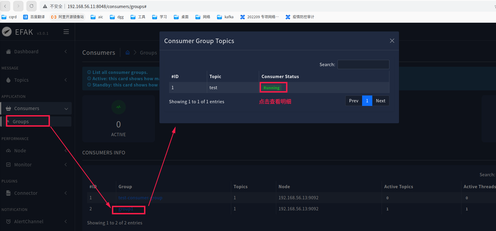
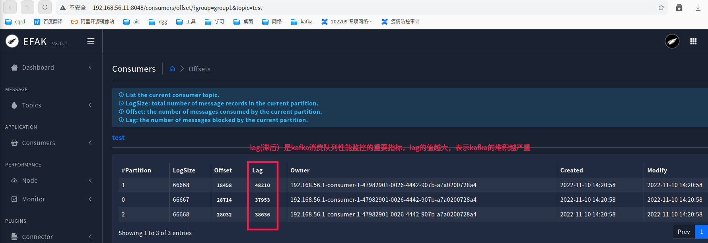
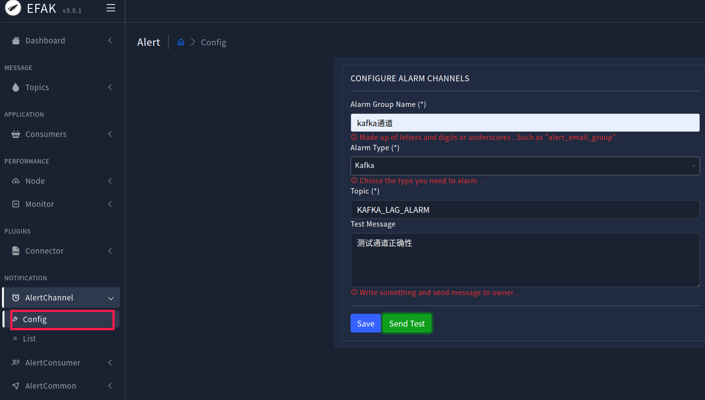
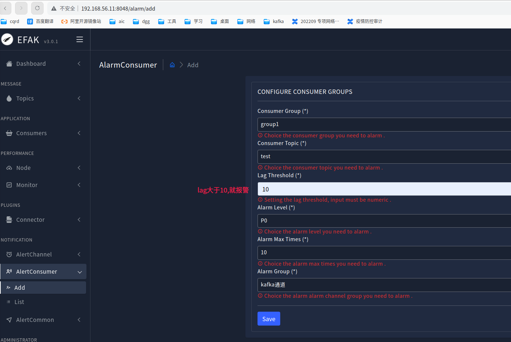

# v2.一键安装安装使用指南
## 1.说明
本方案，需要至少三台服务器，每台服务器需要安装kafka与zookeeper，监控工具efak将安装在第一台，如果想要安装单机版本，[请点此查看方案](./docs/kafka-docker-single.md))

资源要求：4C/8g,`文件打开数`>=655350,文件打开数修改方式如下:  
```shell script
sudo echo "* soft nofile 655350" >> /etc/security/limits.conf
sudo echo "* hard nofile 655350" >> /etc/security/limits.conf
# 退出，重新登录后查看修改结果：
ulimit -n
```

相关组件说明:  
**若想修改一些默认参数，请看官方说明**
* 1.zookeeper
docker地址：<https://hub.docker.com/r/bitnami/zookeeper>

* 2.kafka
docker地址：<https://hub.docker.com/r/bitnami/kafka>

* 3.efak
docker地址：<https://hub.docker.com/r/seawenc/efak>


## 2.版本更新记录


**v2.6.0(计划中)**

> * 1.将kafka认证方式修改为Scram方式，以支持动态新增用户
> * 2.将efak切换为：https://github.com/didi/KnowStreaming

**v2.6.0**.2024-06-28

> * 1.开启权限控制，默认除admin外用户无权限，需手动授权
> * 2.操作示例添加对权限的操作

**v2.5.1**.2023-09-18

> * 1.修复zookeeper未挂载目录bug

**v2.5.0**.2023-02-22

> * 1.将ssh端口提成参数
> * 2.efak数据库添加自动安装脚本

**v2.4.0**.2023-02-17

> * 1.加入docker一键安装
> * 2.添加自动加载离线包功能

**v2.3.0**.2023-02-13

> * 1.将kafka升级到3.4.0
> 
> * 2.解决安装脚本中使用了相对路径bug


**v2.2.0**.2022-11-30

> 1.添加kafka升级文档
>
> 2.升级efak，支持将监控数据发送到kafka（具体请看6.3章节）

**v2.1.0**.2022-11-10
>
> * 1.监控工具efak新增kafka报警通道

**v2.0.1**.2022-09-29
> 将消息生存周期添加到配置文件中

**v2.0.0**.2022-09-20
> * 1.将安装脚本更改为docker方案安装
> * 2.添加zookeeper认证
> * 3.精简掉5个配置项
> * 4.修复efak不支持双ip配置问题
> * 5.新增kafka jmx监控
> * 6.解决ip最后一段相同时的bug

**v1.4.0**.2022-05-14
> * 1.解决存在的两个安全问题。
> * 2.提取数据目录为可配置变量

**v1.3.0**.2022-04-12
> * 1.添加kafka监控程序efak

## 3.安装准备

### 3.0.安装脚本获取
先安装docker,参考： <https://docs.docker.com/engine/install/centos/>

```shell script

# 在任意一台服务器上下载安装脚本，若不能连网，则请直接手动下载源码
git clone https://github.com/sewenc/kafka-ha-installer.git
#或者：
git clone https://gitee.com/seawenc/kafka-ha-installer.git
```
### 3.1.离线安装准备
**若可安装的服务的主机可连网，则请跳过此部署**
```shell script
# 如果目标机器没有docker，则需要先下载docker，下载地址：https://download.docker.com/linux/static/stable/x86_64/

# 找一台可连网已安装docker的服务器,执行以下指令：
docker pull bitnami/zookeeper:3.6.3
# 此鏡像制作參考：dockerfile/Dockerfile.kafka
docker pull bitnami/kafka:3.9.0
# 此鏡像制作參考：
docker pull seawenc/efak:3.0.6
docker save bitnami/zookeeper:3.6.3 | gzip > zk.gz
docker save bitnami/kafka:3.9.0 | gzip > kafka.gz
docker save seawenc/efak:3.0.6 | gzip > efak.gz
```
> 获得到镜像压缩包后，将文件放到**本脚本的packages目录下**（zk.gz、kafka.gz、efak.gz、docker-${DOCKER_VERSION}.tgz） 


### 3.2.目录文件说明
```
├── bin                         : 所有脚本目录
│   ├── common.sh               : 通用工具脚本，无需显式调用
│   ├── step0_unpwd.sh          : 免密码配置脚本，安装ha集群前需执行此脚本进行初始化
│   ├── step1_install_docker.sh : 一键安装docker
│   ├── step2_install_zk.sh     :一键安装zookeeper
│   ├── step3_install_kafka.sh  :一键安装kafka
│   ├── step4_install_efak.sh   :一键安装efak(监控工具)
│   ├── stop_efak.sh            :一键停止efak(监控工具)
│   ├── stop_kafka.sh           :一键停止所有节点的kafka
│   ├── stop_zk.sh              :一键停止所有节点的zookeeper
│   ├── start_zk.sh             :一键启动所有节点的zookeeper
│   ├── start_kafka.sh          :一键启动所有节点的kafka
│   ├── start_efak.sh           :一键启动efak
│   ├── check_kafka.sh          :一键检查所有节点kafka状态
│   ├── check_zk.sh             :一键检查所有节点zookeeper状态
│   └── clear_data.sh           : 清空所有节点数据（调用请慎重）
├── packages                    : 离线安装包目录，其中文件需参考上一章节自行准备
├── conf                        : 所有的配置文件
│   ├── docker                  : docker离线安装所需的文件
│   │    ├── daemon.json        : docker核心配置文件
│   │    └── docker.service     : docker服务文件
│   ├── config.sh               : 核心配置文件，具体配置项，请看下面介绍
│   ├── efak.properties         : 监控工具efak的配置文件，,默认使用本地数据库，建议使用外部mysql
│   └── jaas.conf               : jaas认证文件，若不用新加kafka用户，则可不用修改
├── docs                        : 项目文档目录
├── debug                        : kafka与zookeeper调试脚本
```

### 3.3.配置文件准备 
* 1.`conf/config.sh`:
```shell script
###############################0.参数配置##########################
# docker版本，(若环境未安装docker,需要提前下载放到packages目录中,下载地址：https://download.docker.com/linux/static/stable/x86_64/) 
DOCKER_VERSION=20.10.19
# 基本路径，zookeeper与kafka都安装在此目录,请确保此目录有权限
BASE_PATH=/opt/app/hakafka
# 数据存放目录
DATA_DIR=/opt/app/hakafka/data
# kafka地址,格式:  servers[内网地址]="外网地址" （如果没有网外地址，则与内网设置为一致）
declare -A servers=()
servers["192.168.56.11"]="192.168.55.11"
servers["192.168.56.12"]="192.168.55.12"
servers["192.168.56.13"]="192.168.55.13"
# ssh的端口号
ssh_port=22
# 内网kafka 端口
kafka_port=9092
# 外网kafka 端口
kafka_port_outside=9093
# kafka消息生存时间（单位小时）
kafka_msg_storage_hours=84
# kafka与zookeeper的共用一个账号密码
zkkuser='admin'
zkkpwd='aaBB1122'

# 监控工具efak安装在哪台服务器上,默认是第一台服务器，若想修改，请直接写死
efak_ip=`echo ${!servers[*]} | tr " " "\n" | sort | head -1`
##############################################################
```
* 2.`conf/efak.properties`: 监控工具efak的配置文件，**可不用修改**
* 3.`conf/jaas.conf`: jaas认证文件，若不用新加kafka用户，**则可不用修改**
* 4.`conf/docker`: docker相关的配置，若无特殊需求，**则可不用修改**

### 3.4.开始安装
```shell script
# 步骤0：配置服务器之前的免密
sh bin/step0_unpwd.sh
# 步骤1：安装docker
sh bin/step1_install_docker.sh
# 步骤2：安装zookeeper
sh bin/step2_install_zk.sh
# 步骤3：安装kafka
sh bin/step3_install_kafka.sh
# 步骤4：安装efak，建议使用mysql数据库
sh bin/step4_install_efak.sh
```
> 0. 安装过程中，请仔细阅读每一行日志
> 1. `kafka`,`zookeeper`,`efak`在`bin`目录下都有对应的一键关停/启动脚本,请按需调用
> 2. 若安装过程中状态检查未通过，则请按提示查看日志，解决后继续

**若执行脚本时报换行符的错(关键字包含：\r)，是因为你用window操作系统打开过，执行以下脚本修复:**
```shell script
sed -i 's/\r$//' bin/*.sh
sed -i 's/\r$//' conf/*.sh
```
**若容器内部无法访问宿主机ip，则需要开启网络策略，以ufw指令为例：** `sudo ufw allow from 192.168.255.0/24`


### 3.5.验证安装结果

获得： step3_install_kafka.sh 此脚本的`运行过程中打印出的`**最后三句脚本**，在已安装kafka的节点上执行  
```
# 请手动在其中两台服务器，执行以下指令进入容器后进行测试可用性
docker exec -ti kafka bash
# 新建topic： test，设置分区数据为3,副本数为2
KAFKA_JMX_OPTS="" JMX_PORT=9955 kafka-topics.sh --create --bootstrap-server 192.168.56.11:9092,192.168.56.13:9092,192.168.56.12:9092 --topic test --partitions 3 --replication-factor 2 --command-config /opt/bitnami/kafka/config/producer.properties                                                                                                                                                                                                 
# 试消息生产者与消费者
KAFKA_JMX_OPTS="" JMX_PORT=9955 kafka-console-producer.sh --bootstrap-server 192.168.56.11:9092,192.168.56.13:9092,192.168.56.12:9092 --topic test --producer.config /opt/bitnami/kafka/config/producer.properties
KAFKA_JMX_OPTS="" JMX_PORT=9955  kafka-console-consumer.sh --bootstrap-server 192.168.56.11:9092,192.168.56.13:9092,192.168.56.12:9092 --topic test --consumer.config /opt/bitnami/kafka/config/consumer.properties
```

**若参接收到，则安装成功**

登录efak，查看kafka状态
http://192.168.56.11:8048/
默认用户名密码：admin/123456 (**请及时修改密码**)

## 4.连接方式

### 4.1.kafkatool工具连接
**此方式只用于查看kafka情况时用**

下载地址=<https://www.kafkatool.com/download2/offsetexplorer_64bit.exe>

#### 连接配置

* properties-> cluster name = `mykafka（任意）`  
* properties-> kafka cluster version = `2.8`  
* security -> type = `SASL Plaintext`  
* Advanced -> Bootstrap servers= `192.168.56.11:9092,192.168.56.13:9092,192.168.56.12:9092`  
* Advanced -> SASL Mechanism= `PLAIN`  
* JAAS Config-> `org.apache.kafka.common.security.plain.PlainLoginModule required username="admin" password="aaBB1122";`  

配置完成后，点击`connect`  

#### 查看数据
若需要查看topic中的数据，则点击topic，在`Properties` -> Content Types -> key和value 都设置成 String -> 点击update  

切换到`data`中后可查看数据

### 4.2.java代码连接示例

#### 依赖引入
```groovy
// 以下为gradle方式引入，maven引入请自行转换为xml
compile "org.apache.kafka:kafka-clients:2.2.1"
```

#### 定义公共类-KafkaHelper
```java
import com.alibaba.fastjson.JSON;
import org.slf4j.Logger;
import org.slf4j.LoggerFactory;

import java.util.Properties;

public class KafkaHelper {
    /**
     * 获得kafka的配置,包含groupId
     * @return Properties
     * @throws Exception 异常
     */
    public static synchronized Properties getKafkaConf() throws Exception {
        Properties properties = new Properties();
        properties.setProperty("bootstrap.servers", "192.168.56.11:9092,192.168.56.12:9092,192.168.56.13:9092");
        properties.setProperty("acks", "all");
        properties.setProperty("key.serializer", "org.apache.kafka.common.serialization.StringSerializer");
        properties.setProperty("value.serializer", "org.apache.kafka.common.serialization.StringSerializer");
        properties.setProperty("key.deserializer", "org.apache.kafka.common.serialization.StringDeserializer");
        properties.setProperty("value.deserializer", "org.apache.kafka.common.serialization.StringDeserializer");

        properties.setProperty("sasl.jaas.config", "org.apache.kafka.common.security.plain.PlainLoginModule required username=\"admin\" password=\"aaBB1122\";");
//        properties.setProperty("sasl.mechanism", "SCRAM-SHA-256");
        properties.setProperty("sasl.mechanism", "PLAIN");
        properties.setProperty("security.protocol", "SASL_PLAINTEXT");
        LOG.info("......... kafka props: %s", JSON.toJSONString(properties));
        return properties;
    }
}
```

#### 定义消息生产者
```java
import org.apache.kafka.clients.producer.ProducerRecord;
import org.apache.kafka.clients.producer.RecordMetadata;
import java.util.Properties;
import java.util.concurrent.Future;
/**
 * kafka消息生产者测试
 */
public class KafkaProducer {
    public static void main(String[] args)throws Exception {
       String topic="test";
        Properties props= KafkaHelper.getKafkaConf();
        org.apache.kafka.clients.producer.KafkaProducer<String, String> producer = new org.apache.kafka.clients.producer.KafkaProducer<>(props);
        Thread.sleep(4000);
        for(int i=0;i<1000;i++){
            Thread.sleep(1000);
            Future<RecordMetadata> future= producer.send(new ProducerRecord<>(topic,"发送消息"+i));
            System.out.println(i+"->topic:" + topic+",partition = "+ future.get().partition());
        }
    }
}
```

#### 定义消息消费者
```java
/**
 * kafka消息消费者测试
 */
public class KafkaConsumer {
    public static void main(String[] args) throws Exception {
        String topics="test";
        String groupId="group1";
        Properties properties = KafkaHelper.getKafkaConf();
        properties.setProperty("group.id",groupId);
        org.apache.kafka.clients.consumer.KafkaConsumer<String, String> consumer = new org.apache.kafka.clients.consumer.KafkaConsumer<>(properties);
        consumer.subscribe(Arrays.asList(topics.split(",")));
        Log.info("topic:" + topics + ",props:" + JSON.toJSONString(properties));
        while (true) {
            ConsumerRecords<String, String> records = consumer.poll(100);
            for (ConsumerRecord<String, String> record : records) {
                String value = record.value();
                Log.info("offset = %d, partition = %s, value = %s%n", record.offset(),record.partition(), value);
            }
            Thread.sleep(1000);
        }
    }
}
```
#### 验证
先启动`KafkaConsumer`,再启动`KafkaProducer`,看是否能收消息

## 5.运维

### 5.1、常用指令

``` shell script
#0 先进入容器
docker exec -ti kafka bash
#1.查看topic明细
KAFKA_JMX_OPTS="" JMX_PORT=9955 kafka-topics.sh --describe --bootstrap-server 172.26.23.192:9092,172.26.23.193:9092,172.26.23.194:9092 --topic test --command-config /opt/bitnami/kafka/config/producer.properties

#2.修改topic：test的消息存储时间为48小时
KAFKA_JMX_OPTS="" JMX_PORT=9955 kafka-configs.sh  --bootstrap-server 172.26.23.192:9092,172.26.23.193:9092,172.26.23.194:9092 --alter --entity-name test --entity-type topics --add-config retention.ms=172800000 --command-config /opt/bitnami/kafka/config/producer.properties
#3.立刻删除过期数据
KAFKA_JMX_OPTS="" JMX_PORT=9955 kafka-topics.sh --bootstrap-server 172.26.23.192:9092,172.26.23.193:9092,172.26.23.194:9092 --alter --topic test --config  cleanup.policy=delete --command-config /opt/bitnami/kafka/config/producer.properties

#4.修改分区数为3
KAFKA_JMX_OPTS="" JMX_PORT=9955 kafka-topics.sh --alter --bootstrap-server 172.26.23.192:9092,172.26.23.193:9092,172.26.23.194:9092  --topic test --partitions 3 --command-config /opt/bitnami/kafka/config/producer.properties

#5.修改kafka topic的参数
KAFKA_JMX_OPTS="" JMX_PORT=9955 kafka-configs.sh  --bootstrap-server 172.26.23.192:9092,172.26.23.193:9092,172.26.23.194:9092 --alter --entity-name my_connect_offsets --entity-type topics --add-config cleanup.policy=compact --command-config /opt/bitnami/kafka/config/producer.properties

#6.查看topic的明细
KAFKA_JMX_OPTS="" JMX_PORT=9955 kafka-topics.sh  --bootstrap-server 172.26.23.192:9092,172.26.23.193:9092,172.26.23.194:9092  --describe --topic my_connect_offsets --command-config /opt/bitnami/kafka/config/producer.properties

########################### 对权限的操作
# 列出所有主题的ACL设置
KAFKA_JMX_OPTS="" JMX_PORT=9955 kafka-acls.sh --authorizer-properties zookeeper.connect=192.168.56.10:2181 --list

# 列出指定主题的ACL设置
KAFKA_JMX_OPTS="" JMX_PORT=9955 kafka-acls.sh --authorizer-properties zookeeper.connect=192.168.56.10:2181 --list --topic test

# 权限设置： 设置允许u1用户对test主题拥有所有权限 --operation支持的操作有：READ、WRITE、DELETE、CREATE、ALTER、DESCRIBE、ALL，示例：
KAFKA_JMX_OPTS="" JMX_PORT=9955  kafka-acls.sh --authorizer-properties zookeeper.connect=192.168.56.10:2181 --add --allow-principal User:u1 --operation ALL --topic test

# 权限设置： 设置u1用户对topic主题读操作，前者就包含了允许消费者在主题上READ、DESCRIBE以及在消费者组在主题上READ。
KAFKA_JMX_OPTS="" JMX_PORT=9955  kafka-acls.sh --authorizer-properties zookeeper.connect=192.168.56.10:2181 --add --allow-principal User:u1 --consumer  --topic test

# 权限设置： 设置u1用户对topic主题写操作
KAFKA_JMX_OPTS="" JMX_PORT=9955  kafka-acls.sh --authorizer-properties zookeeper.connect=192.168.56.10:2181 --add --allow-principal User:u1 --producer --topic test
```

### 5.2、kafka离线升级

提供两种升级方式，以下以2.8.1升级到2.8.2为例：

#### 5.2.1、硬升级

但是现在bitnami/kafka还没有2.8.2版本，因此下面的升级脚本不可行，需要等待官方升级才可用此方式

准备镜像（在**可连网的机器上**完成）：

```bash
# 下载镜像
docker pull bitnami/kafka:2.8.1
# 导出镜像
docker save bitnami/kafka:2.8.1 > kafka2.8.1.image
# 将文件上传到服务器
```

在**安装节点**执行：

```bash
# 第一步：停止kafka
sh bin/stop_kafka.sh
# 第二步：修改安装脚本中的kafka的版本号改为2.8.2(此步骤若不重装，无太大意思)
sed -i 's/2.8.1/2.8.2/g' step3_install_kafka.sh
```

在**kafka三台工作节点**上执行：

```bash
# 导入镜像
docker load < kafka2.8.1.image
# 在kafka的三台服务器上执行，修改版本号：,修改完成后，可检查run.sh中版本号是否已修改
sed -i 's/2.8.1/2.8.2/g' {安装路径}/kafka/run.sh
```

在**安装节点**执行：

```bash
# 启动kafka
sh bin/start_kafka.sh
```

完成后查看efak查看kafka是否正常


#### 5.2.2、软升级

若可硬升级，则用硬升级，若不能硬升级，再用此法

```
# 在可连网的机器上，下载2.8.2安装包：
wget -c https://archive.apache.org/dist/kafka/2.8.2/kafka_2.12-2.8.2.tgz
# 解压后只需要`libs`目录中的数据，将libs包放到：{安装路径}/kafka/
```

在**安装节点**执行：

```bash
# 第一步：停止kafka
sh bin/stop_kafka.sh
# 等待3分钟，让kafka的停止数据刷新到了zk后，才能执行下一步
```

在**kafka三台工作节点**上执行：

```bash
cd {安装路径}/kafka/
# 将镜像中的libs目录外挂为新版本libs，请替代换变量`{安装路径}`后执行
sed -i 's@bitnami/kafka:2.8@-v {安装路径}/kafka/libs:/opt/bitnami/kafka/libs bitnami/kafka:2.8@g' run.sh
#检查一下脚本中是否新增了挂载：-v {安装路径}/kafka/libs:/opt/bitnami/kafka/libs
cat run.sh
# 检查没问题后，手动执行启动（不能用安装节点的start_kafka.sh）
sh run.sh
```

> 升级完成后，重启kafka可直接用安装节点的`start_kafka.sh`

软升级完成，登录 efak验证kafka可用性


##### **软装回滚方法**

在**kafka三台工作节点**上执行：

```
cd {安装路径}/kafka/
sed -i 's@-v {安装路径}/kafka/libs:/opt/bitnami/kafka/libs@@g' run.sh
#检查一下脚本中是否删除了挂载：-v {安装路径}/kafka/libs:/opt/bitnami/kafka/libs
cat run.sh
# 检查没问题后，手动执行启动（不能用安装节点的start_kafka.sh）
sh run.sh
```

> 回滚完成后，重启kafka可直接用安装节点的`start_kafka.sh`


#### 5.2.3、v1.x脚本升级到v2.x  

v1.x版本原始为非docker版本，现需要全部重新升级到docker版本  
经验证：升级后，数据无法读取，原因为原来的zookeeper是非加密的，新版本的是加了密码的，新版本读取不到topic的元数据信息

### 5.3、efak升级

当前版本为3.0.6, 若有新版本，请替换版本号

```bash
# 下载镜像
docker pull seawenc/efak:3.0.6
# 导出镜像
docker save seawenc/efak:3.0.6 > efak3.0.6.image
# 将文件上传到服务器
```

在efak节点上执行：

```bash
docker load < efak3.0.3.image
# 修改启动脚本的版本号为3.0.3
vi  {安装路径}/efak/run.sh
# 重启
sh {安装路径}/efak/run.sh
```


## 6.efak监控与报警

efak默认账号信息为:`admin/123456`,第一次登录后记得修改密 码!

本套环境新增kafka报警通道，报警设置只支持group未消费消息报警配置； 

### 1.查看topic group未消费的数据






### 2.监控lag参数

`lag`(滞后）是kafka消费队列性能监控的重要指标，lag的值越大，表示kafka的堆积越严重。

2.1.首先配置kafka报警通道



2.2.配置具体的group lag报警



配置完成后，就可看到报警的topic:`KAFKA_LAG_ALARM`已经有数据了

消息格式为:
```json
{
    "alarmContent": "{\"cluster\":\"cluster1\",\"current\":94462,\"max\":10,\"topic\":\"test\",\"group\":\"group1\"}", 
    "alarmStatus": "PROBLEM", 
    "alarmCluster": "cluster1", 
    "alarmId": 1, 
    "alarmProject": "Consumer", 
    "alarmTimes": "current(0), max(10)", 
    "alarmLevel": "P1", 
    "title": "kafka通道 alarm!", 
    "type": "kafka", 
    "alarmDate": "2022-11-10 14:09:01"
}
```
其中: `alarmContent -> current:` 为`lag`的值

### 3.监控数据输出

从版本 `seawenc/efak:3.0.3`支持，监控数据输出到kafka

```json
{
    "brokersLeaderSkewed":33,  # 以下三个参数含义：
    "brokersSkewed":0,         # https://blog.csdn.net/L13763338360/article/details/105427584
    "brokersSpread":100,
    "collectTime":"2022-11-30 10:28:00",
    "consumers":[                # 消费者信息
        {
            "consumption1m":1432,         # 1分钟内消息，此消费都消费的消息数量
            "group":"group1",             # group名称，相同的group共同消费一份数据
            "lag":99872,                  # 还剩下多少数据没有被消费
            "node":"192.168.56.12:9092",  # 它连接的是哪个节点
            "offsets":[                   # 每个分区的消费明细
                {
                    "lag":33269,            # 在分区1上，还有多少消息未被消费
                    "logSize":1,            # 没有太大意义，好像永远等于：partition的值
                    "offset":189616,        # 当前offset你部署
                    "owner":"192.168.56.1", # 消费者所在ip
                    "partition":1           # 所在分区，一个分区一条数据，
                },
                ...
            ]
        }
        ...        
    ],
    "partitions":[                # 分区明细
        {
            "isr":"[2,1]",        # 副本所在节点
            "leader":2,           # 主副本你部署
            "logSize":56217,      # 当前的数据条数
            "partitionId":0,          # 分区编号
            "preferredLeader":false,  # 是否是leader
            "replicas":"[1, 2]",      # 与isr一致（重复）
            "underReplicated":false   # 是否副本不足
        },
        ...
    ],
    "rows":168652,              # 现有数据量
    "rows1m":3242,              # 1分钟内产生的数据量，
    "storageSize":13.65,        # 所占空间大小，单位为：storagesizeUnit
    "storagesizeUnit":"MB",     # 所占空间大小的单位
    "topic":"test"              # topic名称
}
```

关于指标`rows1m`：若上一分钟数据发生清理，暂时无法解决，此值将会小于0,应用程序需自行处理此问题

默认以上监控数据会输出到topic:TOPIC_MONITOR,若想修改，则在配置文件中加入配置项,例：efak.monitor.topic=topic_monitor

## 7.安全

### jmx未授权漏洞
以上安装方式会出现jmx未授权漏洞，此问题暂时只能通过防火墙来控制，以iptables为例：
```bash
# 在3台机器上执行以下脚本，其中172.26.3.x 三个ip为kafka服务器ip，192.168.255.0/24为docker容器ip，请自行替换
systemctl restart docker
iptables -I DOCKER-USER -p tcp --dport 9999 -j DROP
iptables -I DOCKER-USER -p tcp --dport 9999 -s 172.26.3.10 -j ACCEPT
iptables -I DOCKER-USER -p tcp --dport 9999 -s 172.26.3.11 -j ACCEPT
iptables -I DOCKER-USER -p tcp --dport 9999 -s 172.26.3.12 -j ACCEPT
iptables -I DOCKER-USER -p tcp --dport 9999 -s 192.168.255.0/24 -j ACCEPT
iptables -nL --line-number
iptables-save
iptables-save > /etc/sysconfig/iptables
systemctl enable iptables.service
systemctl enable iptables.service
iptables -nL --line-number

# 删除一条规则

iptables -D INPUT -p tcp --dport 80 -j ACCEPT
```

ufw 防火墙:
```bash

ufw enable
ufw allow from 172.26.3.10
ufw allow from 172.26.3.11
ufw allow from 172.26.3.12

ufw allow 9092/tcp
ufw allow 9093/tcp
ufw allow 8048/tcp

ufw reload

```


### 老版本zookeeper挂载目录不正确修复

在2023年4月份之前的版本，step2_install_zk.sh脚本中，挂载路径不正确：`-v $DATA_DIR/zookeeper:/data`，正确的路径为：`-v $DATA_DIR/zookeeper:/bitnami/zookeeper`  
此问题会导致：若zookeeper出现重启，集群将会异常，通过以下方式，可不停服务升级：  
```shell
##### 以下脚本一台一台处理，启动成功后，再进行另外一台

DATA_DIR= #此值请在conf文件中获取，默认：/opt/app/zkafka/data
docker cp zookeeper:/bitnami/zookeeper $DATA_DIR
chmod 777 -R $DATA_DIR/zookeeper
# 在启动脚本中修复挂载点：在vi脚本，加入：-v $DATA_DIR/zookeeper:/bitnami/zookeeper，并删除原来不正确的挂载
vi $BASE_PATH/zookeeper/run.sh

# 重新启动
docker stop zookeeper && docker rm zookeeper
sh $BASE_PATH/zookeeper/run.sh

# 检查zookeeper状态,如果都正常，再处理下一台
sh kafka-ha-installer/bin/check_zk.sh

```


